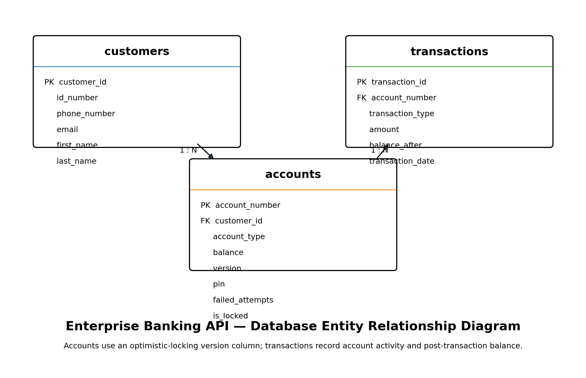

# Enterprise Banking API

A production-oriented Spring Boot REST API for an enterprise-style banking application.

The API provides account management and financial transaction capabilities backed by MySQL, with transaction management, optimistic locking, request validation, consistent HTTP error responses, database migrations, automated integration testing, and OpenAPI documentation.

---

## Overview

The Enterprise Banking API is the backend service for a full-stack banking application.

It currently provides REST endpoints for:

* Retrieving account information
* Retrieving transaction history
* Depositing funds
* Withdrawing funds
* Transferring funds between accounts

Financial operations use Spring transaction management so related database changes succeed or roll back together.

---

## Key Features

* Account balance retrieval
* Transaction history
* Deposits
* Withdrawals
* Account-to-account transfers
* Atomic transfer processing
* Transaction rollback for failed operations
* Request validation
* Global exception handling
* RFC 9457-style `ProblemDetail` error responses
* Optimistic locking for concurrent account updates
* MySQL persistence
* Flyway database migrations
* H2-based automated tests
* OpenAPI / Swagger documentation
* CORS configuration through environment variables
* Maven-based build and test lifecycle

---

## Technology Stack

| Technology        | Purpose                          |
| ----------------- | -------------------------------- |
| Java 25           | Application language and runtime |
| Spring Boot 4.1.1 | Application framework            |
| Spring MVC        | REST API                         |
| Spring Data JPA   | Persistence abstraction          |
| Hibernate         | ORM                              |
| MySQL             | Production database              |
| Flyway            | Database migrations              |
| H2                | Test database                    |
| Maven             | Build and dependency management  |
| SpringDoc OpenAPI | API documentation                |
| JUnit             | Automated testing                |

---

## Architecture

The application follows a layered architecture:

```text
HTTP Request
     |
     v
Controller
     |
     v
Service
     |
     v
Repository
     |
     v
MySQL Database
```

### Controller layer

Handles HTTP requests, request validation, API documentation, and HTTP responses.

### Service layer

Contains banking business logic and transaction boundaries.

### Repository layer

Provides persistence through Spring Data JPA.

### Database layer

## Database Architecture

The Enterprise Banking API uses a relational MySQL database with separate entities for customers, accounts, and transactions.

The schema also includes an optimistic-locking version column on accounts to protect account balance updates from concurrent modifications.



The ERD documents the relationships between customers, accounts, and transactions and reflects the persistence model used by the application.

---

## Project Structure

```text
enterprise-banking-api/
│
├── src/
│   ├── main/
│   │   ├── java/
│   │   │   └── com/phakiso/enterprisebankingapi/
│   │   │       ├── account/
│   │   │       ├── config/
│   │   │       ├── exception/
│   │   │       └── transaction/
│   │   │
│   │   └── resources/
│   │       ├── application.yaml
│   │       └── db/
│   │           └── migration/
│   │
│   └── test/
│       ├── java/
│       │   └── com/phakiso/enterprisebankingapi/
│       └── resources/
│           └── application-test.yaml
│
├── pom.xml
├── mvnw
├── mvnw.cmd
├── .gitignore
└── README.md
```

---

## REST API

Base URL:

```text
http://localhost:8080
```

### Account

Retrieve account details:

```http
GET /api/v1/accounts/{accountNumber}
```

Example:

```http
GET /api/v1/accounts/888888
```

Example response:

```json
{
  "accountNumber": 888888,
  "customerId": 888888,
  "accountType": "Savings",
  "balance": 35000.00
}
```

---

### Deposit

```http
POST /api/v1/accounts/{accountNumber}/deposits
```

Example request:

```json
{
  "amount": 1000.00
}
```

---

### Withdrawal

```http
POST /api/v1/accounts/{accountNumber}/withdrawals
```

Example request:

```json
{
  "amount": 500.00
}
```

---

### Transfer

```http
POST /api/v1/accounts/{accountNumber}/transfers
```

Example request:

```json
{
  "destinationAccountNumber": 999999,
  "amount": 1000.00
}
```

Transfers are processed atomically. The source account, destination account, and transaction records are handled within the same transaction boundary.

---

### Transaction History

```http
GET /api/v1/accounts/{accountNumber}/transactions
```

Returns transaction history associated with an account.

---

## Error Handling

The API uses a centralized exception-handling mechanism.

Errors are returned using Spring's `ProblemDetail` representation where appropriate.

Typical HTTP responses include:

| Status | Meaning                                            |
| ------ | -------------------------------------------------- |
| `200`  | Operation completed successfully                   |
| `400`  | Invalid request or validation failure              |
| `404`  | Account or resource does not exist                 |
| `409`  | Concurrent account modification                    |
| `422`  | Business rule violation such as insufficient funds |

---

## Optimistic Locking

Account updates use optimistic locking to protect against concurrent modifications.

The account entity maintains a version value which allows the application to detect when another transaction has modified the same account before an update is completed.

A concurrent modification results in an appropriate conflict response rather than silently overwriting another transaction's changes.

---

## Database

The production application uses MySQL.

Database schema changes are managed through Flyway migrations located under:

```text
src/main/resources/db/migration/
```

Current migration:

```text
V2__add_account_version.sql
```

The migration adds the account version required for optimistic locking.

---

## Configuration

Application configuration is located in:

```text
src/main/resources/application.yaml
```

Test-specific configuration is located in:

```text
src/test/resources/application-test.yaml
```

Environment-specific values should be supplied through environment variables rather than committed credentials.

Database credentials and other environment-specific configuration should therefore remain outside source control.

---

## OpenAPI Documentation

The API includes OpenAPI documentation through SpringDoc.

When the application is running, Swagger UI is available at:

```text
http://localhost:8080/swagger-ui.html
```

The generated OpenAPI specification is available at:

```text
http://localhost:8080/v3/api-docs
```

These endpoints can be used to explore and test the API interactively.

---

## Running the Application

### Requirements

* Java 25
* Maven
* MySQL
* A configured `enterprise_banking` database

### Start the application

From the `enterprise-banking-api` directory:

```powershell
.\mvnw.cmd spring-boot:run
```

The API will start on:

```text
http://localhost:8080
```

---

## Running Tests

From the `enterprise-banking-api` directory:

```powershell
.\mvnw.cmd test
```

The test suite covers unit, controller, database/integration, optimistic-locking, and OpenAPI behaviour.

The current test suite contains **30 automated tests**, all passing.

---

## Build Verification

The project can be verified with:

```powershell
.\mvnw.cmd test
```

A successful build ends with:

```text
BUILD SUCCESS
```

Additional Git checks:

```powershell
git diff --check
git status
```

The working tree should be clean before committing.

---

## API Verification

With the application running, account retrieval can be verified with:

```powershell
Invoke-WebRequest http://localhost:8080/api/v1/accounts/888888 -UseBasicParsing |
    Select-Object StatusCode, Content
```

Expected result:

```text
StatusCode: 200
```

Swagger UI can be verified with:

```powershell
Invoke-WebRequest http://localhost:8080/swagger-ui.html -UseBasicParsing |
    Select-Object StatusCode
```

OpenAPI can be verified with:

```powershell
Invoke-WebRequest http://localhost:8080/v3/api-docs -UseBasicParsing |
    Select-Object StatusCode
```

Both should return:

```text
200
```

---

## Testing Strategy

The project contains several layers of automated testing:

### Unit tests

Business logic is tested independently of the HTTP layer.

### Controller tests

REST controller behaviour, request handling, validation, and responses are tested.

### Integration tests

The application context and real HTTP behaviour are tested through isolated integration tests.

### Optimistic locking tests

Concurrent account modification scenarios are tested to verify conflict handling.

### OpenAPI integration test

The generated OpenAPI documentation is verified as part of the automated test suite.

---

## Development History

The project has evolved incrementally from a basic account API into a more production-oriented banking backend.

Major milestones include:

* Account persistence
* Account retrieval API
* Transaction persistence
* Transaction history
* Deposits
* Withdrawals
* Transaction rollback
* API validation
* Global exception handling
* Optimistic locking
* Transfer processing
* Integration testing
* OpenAPI documentation
* Externalized CORS configuration

---

## Current Status

The backend currently provides:

* RESTful account operations
* Transaction history
* Deposits
* Withdrawals
* Account transfers
* Transaction management
* Optimistic locking
* MySQL persistence
* Flyway migrations
* Global error handling
* OpenAPI documentation
* Automated testing
* Externalized CORS configuration

The API is being developed as the backend foundation for the Enterprise Banking full-stack application.

---

## Related Project

Frontend:

```text
enterprise-banking-web
```

The frontend is built with React and Vite and consumes this REST API.

---

## Author

**Phakiso**

Enterprise Banking API — full-stack banking application portfolio project.
