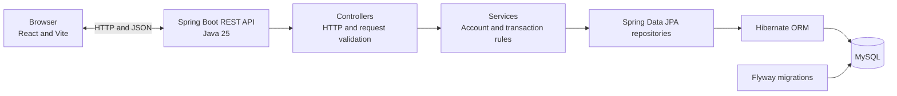
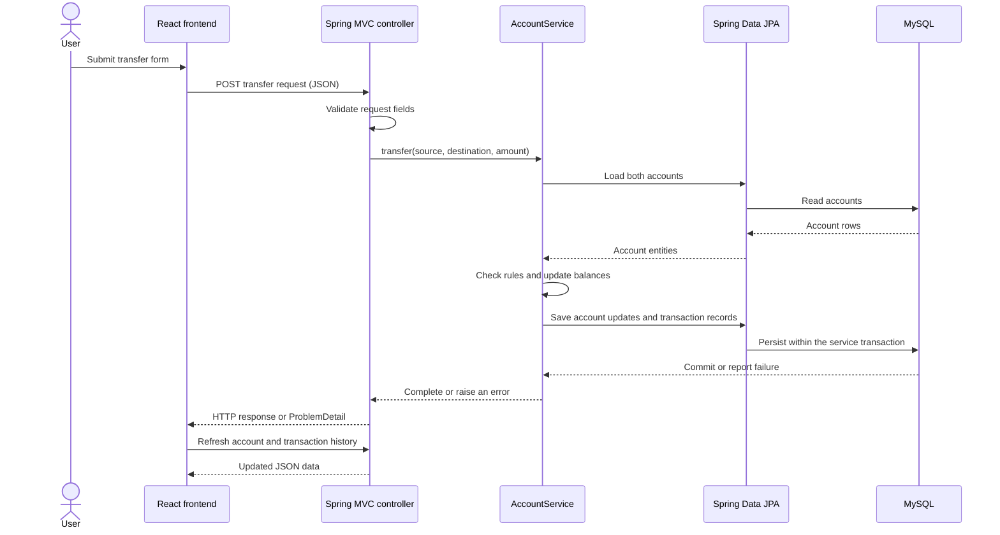

# Enterprise Banking Application Architecture

## Purpose and scope

This guide describes the current portfolio application: a React and Vite frontend, a Spring Boot REST API, and a MySQL database. It focuses on the code and schema that exist today. The application demonstrates common full-stack patterns and basic account operations; it is not a real banking service and does not implement user authentication or authorization.

## System overview

The web app reads account details and transaction history and submits deposits, withdrawals, and transfers. The API owns the account rules and persistence. The browser never connects directly to MySQL. Flyway creates and evolves the schema; Hibernate maps Java entities to rows and checks that the schema matches the mappings.

## Request flow

The frontend tracks loading and error state while requests are in flight. It can reject obviously invalid form input for a better user experience, but the API remains authoritative and validates requests independently.

## Backend layers

| Layer | Current responsibility |
| --- | --- |
| `AccountController`, `TransactionController` | Map HTTP routes, validate request DTOs, call services, and return API responses. |
| `AccountService` | Retrieve account details and coordinate deposits, withdrawals, and transfers. |
| `TransactionService` | Create transaction records and retrieve account history. During money operations it is called within the surrounding `AccountService` transaction. |
| `AccountRepository`, `TransactionRepository` | Read and save entities through Spring Data JPA. |
| `Account`, `Transaction` | JPA entities mapped to the two tables. `Account` uses `@Version` for optimistic locking. |
| `GlobalExceptionHandler` | Converts validation, missing-account, insufficient-funds, invalid-transfer, and optimistic-locking errors into HTTP error responses, using `ProblemDetail`. |

The request DTOs are `DepositRequest`, `WithdrawalRequest`, and `TransferRequest`. Response DTOs keep API output separate from persistence entities.

## Money operations and consistency

`AccountService.deposit`, `withdraw`, and `transfer` use `@Transactional`. Each operation changes the relevant account balance and creates its transaction record or records within the same database transaction. A transfer changes both accounts and records a `Transfer Out` and a `Transfer In`. If the operation fails, the database transaction rolls back so it does not retain only part of the operation.

Amounts are represented as Java `BigDecimal` and stored in MySQL `DECIMAL(19,2)` columns. `Account` has a JPA `@Version` field. Hibernate uses that value when updating an account; a stale concurrent update is rejected and the API maps the conflict to HTTP 409.

## Database schema

The two current tables are created by Flyway migrations under `src/main/resources/db/migration/`:

| Table | Current role and key columns |
| --- | --- |
| `accounts` | One row per account. `account_number` is the primary key. The row also has `customer_id`, `account_type`, `balance`, `version`, and the existing `pin`, `failed_attempts`, and `is_locked` columns. The application does not currently define a separate Customer entity or a login flow. |
| `transactions` | One row per recorded operation. `transaction_id` is the primary key; other columns include `account_number`, `transaction_type`, `amount`, `balance_after`, and `transaction_date`. |

`customer_id` is a value stored on the account; there is no `customers` table in the current migration. Likewise, `transactions.account_number` is used by the application to find an account's history, but the current migration does not declare it as a database foreign key. This distinction matters when describing the actual schema.

### Fresh database startup

1. Create the MySQL database and configure the API connection with environment variables.
2. Start the Spring Boot application. Flyway checks its schema history and applies pending migrations in version order: V1 creates `accounts` and `transactions`; V2 adds `accounts.version` with a default value.
3. Hibernate starts with `ddl-auto: validate`, which checks the entity mappings against the resulting schema without creating or changing tables.
4. The API begins serving requests if database connection, migrations, and schema validation succeed.

The migrations create tables but do not seed demonstration accounts. A local developer can insert sample accounts when trying the UI; the API README contains an example.

## Configuration and supporting behavior

- `src/main/resources/application.yaml` contains the main configuration. Database URL, username, password, and allowed CORS origin can be supplied through `DB_URL`, `DB_USERNAME`, `DB_PASSWORD`, and `APP_CORS_ALLOWED_ORIGIN`.
- CORS allows one configured frontend origin for `/api/**`. The local default is `http://localhost:5173`.
- `SecurityHeadersFilter` sets `X-Content-Type-Options`, `X-Frame-Options`, `Referrer-Policy`, and `Permissions-Policy` response headers. These headers do not provide authentication or authorization.
- Actuator exposes health information only; health probes are enabled.
- Springdoc API docs and Swagger UI are enabled by default and can be disabled through `SPRINGDOC_API_DOCS_ENABLED` and `SPRINGDOC_SWAGGER_UI_ENABLED`. The `application-prod.yaml` profile disables them by default and requires the database and CORS settings through environment variables.
- Local secrets belong in developer environment configuration, not committed source files. Frontend `VITE_` variables are bundled into browser code and must contain non-secret values only.

## Testing and CI

The API test profile uses an isolated in-memory H2 database, disables Flyway, and uses Hibernate `create-drop`. It does not test migrations against MySQL. The project record separately documents a completed manual fresh-MySQL startup verification.

The API GitHub Actions workflow runs the Maven `verify` lifecycle on pushes and pull requests targeting `main`. The web workflow installs with `npm ci`, then runs lint, tests, and a production build. These workflows provide repeatable checks; they do not deploy the application.

## Security scope and limitations

The application has no authentication or authorization. The UI is configured to display one account number, but that configuration is not an identity or access-control mechanism. Do not use real account credentials, personal data, or money with this portfolio application. A real banking product would require a separately designed and reviewed security, audit, operations, and compliance model.

## Related project documentation

- [API setup and endpoint guide](../README.md)
- [API request examples](api-examples.md)
- [Web application and screenshots](https://github.com/PhakisoP/enterprise-banking-web)
