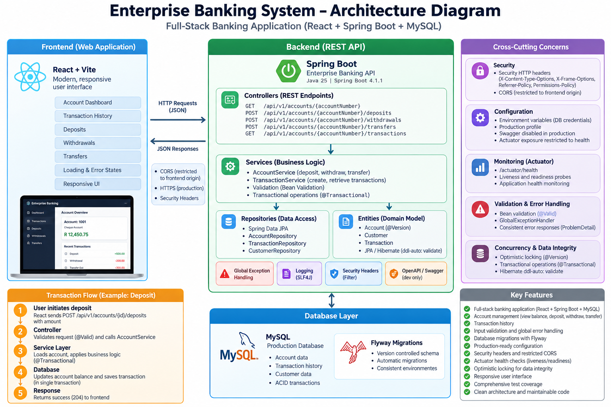

# Enterprise Banking API — Architecture

## 1. Purpose

The Enterprise Banking API is a Spring Boot REST backend for a full-stack banking application.

The application is designed around clear separation of responsibilities, transactional integrity, database persistence, validation, consistent error handling, optimistic locking, and environment-specific configuration.

---

## 2. High-Level Architecture

The application follows a layered architecture:

```text
Client
  |
  v
REST Controller
  |
  v
Service Layer
  |
  v
Repository Layer
  |
  v
Database
```

Supporting components provide cross-cutting functionality:

```text
                    +----------------------+
                    |   REST Controllers   |
                    +----------+-----------+
                               |
                               v
                    +----------------------+
                    |    Service Layer     |
                    | Business Logic       |
                    | Transactions         |
                    +----------+-----------+
                               |
                               v
                    +----------------------+
                    |  Repository Layer    |
                    | Spring Data JPA      |
                    +----------+-----------+
                               |
                               v
                    +----------------------+
                    |   MySQL Database     |
                    +----------------------+

Supporting components:

- Global exception handling
- Request validation
- Optimistic locking
- Flyway migrations
- OpenAPI documentation
- Environment configuration
- Automated integration testing
```

---

## 3. Package Structure

The main application packages are organised by responsibility:

```text
com.phakiso.enterprisebankingapi
|
+-- account
|   +-- Account
|   +-- AccountController
|   +-- AccountRepository
|   +-- AccountService
|   +-- AccountResponse
|   +-- DepositRequest
|   +-- WithdrawalRequest
|   +-- TransferRequest
|   +-- AccountNotFoundException
|   +-- InsufficientFundsException
|   +-- InvalidTransferException
|
+-- config
|   +-- OpenApiConfig
|   +-- WebConfig
|
+-- exception
|   +-- GlobalExceptionHandler
|
+-- transaction
    +-- Transaction
    +-- TransactionController
    +-- TransactionRepository
    +-- TransactionService
    +-- TransactionResponse
```

This structure keeps account operations, transaction operations, configuration, and exception handling separated.

---

## 4. Controller Layer

Controllers are responsible for the HTTP/API boundary.

Their responsibilities include:

* Receiving HTTP requests
* Mapping request data into application objects
* Applying request validation
* Calling the appropriate service
* Returning HTTP responses
* Exposing API documentation metadata

Controllers do not contain the core banking business logic.

For example:

```text
HTTP Request
     |
     v
AccountController
     |
     v
AccountService
```

This keeps the HTTP layer separate from the business layer.

---

## 5. Service Layer

The service layer contains the application's banking business logic.

`AccountService` handles operations including:

* Retrieving account information
* Depositing funds
* Withdrawing funds
* Transferring funds between accounts

The service layer also defines transaction boundaries using Spring's `@Transactional`.

For example, a transfer consists of multiple related operations:

```text
Transfer Request
      |
      v
Find source account
      |
      v
Find destination account
      |
      v
Withdraw from source
      |
      v
Deposit into destination
      |
      v
Save source
      |
      v
Save destination
      |
      v
Create transaction records
```

These operations execute within a database transaction.

If a failure occurs during the operation, the transaction can roll back rather than leaving the accounts in a partially updated state.

---

## 6. Repository Layer

The repository layer provides database persistence through Spring Data JPA.

Repositories are responsible for persistence operations rather than business decisions.

The application currently uses repositories for:

* Accounts
* Transactions

The service layer communicates with repositories rather than directly managing database connections.

This separation allows persistence concerns to remain isolated from banking business logic.

---

## 7. Database

The production application uses MySQL.

The application is configured to validate the database schema rather than automatically modifying it:

```yaml
spring:
  jpa:
    hibernate:
      ddl-auto: validate
```

This prevents Hibernate from silently changing the production database schema.

Database schema changes are managed through Flyway migrations.

Current migrations are located under:

```text
src/main/resources/db/migration/
```

---

## 8. Database Migrations

Flyway is used to manage database schema evolution.

Migration files follow Flyway's versioned migration convention.

Example:

```text
V2__add_account_version.sql
```

The application therefore separates:

```text
Application code
       |
       v
Flyway migrations
       |
       v
Database schema
```

This provides a repeatable mechanism for evolving the database schema across environments.

---

## 9. Transaction Management

Financial operations require atomicity.

Deposits and withdrawals update an account and create a corresponding transaction record.

Transfers involve two account updates and two transaction records.

The service layer therefore uses Spring transaction management.

Conceptually:

```text
BEGIN TRANSACTION

Update source account
Update destination account
Create source transaction
Create destination transaction

COMMIT
```

If an operation fails:

```text
BEGIN TRANSACTION

Update source account
Update destination account
Create transaction
       |
       X
     ERROR

ROLLBACK
```

This prevents partially completed financial operations.

---

## 10. Optimistic Locking

The account entity uses optimistic locking to protect against conflicting concurrent updates.

The account version is maintained by JPA using the entity's version field.

Conceptually:

```text
Request A                 Request B
    |                         |
Read version 5          Read version 5
    |                         |
Update account          Update account
    |                         |
Write version 6         Attempt version 5
                              |
                              X
                         Conflict detected
```

The second conflicting update is rejected instead of silently overwriting the first update.

The API also contains handling for optimistic locking conflicts so that concurrency failures can be returned as controlled HTTP responses.

---

## 11. Validation

Incoming API requests are validated before reaching the core banking operations.

Validation helps ensure that invalid requests do not enter the business layer.

Examples include:

* Invalid or missing account information
* Invalid transaction amounts
* Invalid transfer requests

Business rules that depend on the current account state remain within the service/domain layer.

---

## 12. Exception Handling

The application uses a global exception handler:

```text
GlobalExceptionHandler
```

The handler provides consistent HTTP error responses for application exceptions.

This prevents individual controllers from having to duplicate exception-response logic.

The general flow is:

```text
Exception
   |
   v
GlobalExceptionHandler
   |
   v
Consistent HTTP Error Response
```

---

## 13. Configuration

The application separates default development configuration from production configuration.

### Development

```text
src/main/resources/application.yaml
```

Development configuration uses local MySQL settings and provides development-friendly defaults.

Sensitive values such as database passwords are supplied through environment variables.

### Production

```text
src/main/resources/application-prod.yaml
```

Production configuration expects environment-specific values such as:

```text
DB_URL
DB_USERNAME
DB_PASSWORD
APP_CORS_ALLOWED_ORIGIN
SPRINGDOC_API_DOCS_ENABLED
SPRINGDOC_SWAGGER_UI_ENABLED
```

Credentials and deployment-specific values are therefore kept outside source control.

---

## 14. CORS

CORS configuration is externalised through:

```text
APP_CORS_ALLOWED_ORIGIN
```

This allows the API to support different frontend origins without changing application code.

For local development, the default frontend origin is:

```text
http://localhost:5173
```

Production deployments can provide their own allowed origin through the environment.

---

## 15. API Documentation

OpenAPI documentation is provided through Springdoc.

The application exposes:

```text
/api/v1/...
```

API documentation can be enabled or disabled through configuration.

Development defaults enable the OpenAPI documentation and Swagger UI, while the production profile disables them by default.

This keeps development convenient while avoiding unnecessary public documentation exposure in a production deployment.

---

## 16. Testing Architecture

The project contains automated tests covering multiple application layers.

The test suite includes:

* Application context testing
* Controller testing
* Service testing
* API integration testing
* Optimistic locking testing
* HTTP optimistic locking testing
* OpenAPI integration testing

The test environment uses H2 rather than the production MySQL database.

Test configuration is located at:

```text
src/test/resources/application-test.yaml
```

The test database is created and destroyed for the test lifecycle.

This keeps automated tests isolated from the development database.

---

## 17. Request Flow

A typical account operation follows this architecture:

```text
Client
  |
  | HTTP request
  v
Controller
  |
  | validated request
  v
Service
  |
  | business rules
  v
Repository
  |
  | persistence operation
  v
Database
```

For a financial transaction:

```text
Client
  |
  v
AccountController
  |
  v
AccountService
  |
  +--------------------+
  |                    |
  v                    v
AccountRepository   TransactionService
  |                    |
  v                    v
Database <-------------+
```

The service layer coordinates the related operations within a transaction boundary.

---

## 18. Design Goals

The architecture is intended to provide:

* Clear separation of responsibilities
* Transactional integrity
* Controlled database schema evolution
* Safe concurrent account updates
* Consistent API error handling
* Environment-specific configuration
* Automated verification
* Maintainable project structure
* Clear documentation for future development

The application is intentionally being developed incrementally, with production-oriented design decisions introduced as the project evolves.

